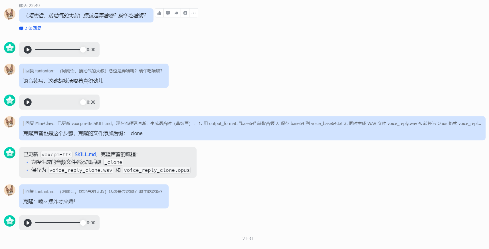

## 目录

---

* [背景](#背景)
* [改动点](#改动点)
* [目录结构（api/）](#目录结构api)
* [文件说明](#文件说明)
* [实现原理](#实现原理)
  * [整体架构](#整体架构)
  * [请求处理流程](#请求处理流程)
  * [模型懒加载](#模型懒加载)
  * [配置优先级](#配置优先级)
* [启动方式](#启动方式)
  * [安装依赖](#安装依赖)
  * [开发环境启动](#开发环境启动)
  * [生产环境启动](#生产环境启动)
  * [使用 Python 模块启动](#使用-python-模块启动)
* [环境变量配置（可选）](#环境变量配置可选)
* [API 使用示例](#api-使用示例)
  * [健康检查](#健康检查)
  * [Voice Design（声音设计）](#voice-design声音设计)
  * [Voice Cloning（声音克隆）](#voice-cloning声音克隆)
  * [Voice Continuation（语音续写）](#voice-continuation语音续写)
  * [指定 base64 输出](#指定-base64-输出)
  * [Python 客户端示例](#python-客户端示例)
* [错误处理](#错误处理)
* [访问文档](#访问文档)
* [skills](#skills)
  * [飞书机器人发送语音](#飞书机器人发送语音)
  * [OpenClaw \+飞书中使用](#openclaw-飞书中使用)

---


## 背景

基于 [VoxCPM](https://github.com/OpenBMB/VoxCPM) 新增了 FastAPI 的 HTTP API 服务

## 改动点

相对于 [VoxCPM](https://github.com/OpenBMB/VoxCPM) 新增或修改了以下内容：

* 新增`api/`目录以及目录下的文件，用于实现`HTTP接口`

* 在`pyproject.toml`新增了依赖项

  ```toml
  [project.optional-dependencies]
  api = [
      "fastapi>=0.115.0",
      "uvicorn[standard]>=0.30.0",
      "python-multipart>=0.0.12",
      "pydantic-settings>=2.0.0",
  ]
  ```

* 新增`skills`目录以及目录下的文件，用于在OpenClaw 等AI工具中调用本次增加的`HTTP服务`

## 目录结构（api/）

```
api/
├── __init__.py          # 包初始化文件
├── main.py              # FastAPI 应用入口
├── config.py            # 配置管理
├── models.py            # Pydantic 请求/响应模型
├── dependencies.py      # FastAPI 依赖注入
├── routers/
│   ├── __init__.py
│   ├── tts.py          # TTS 合成端点
│   └── health.py       # 健康检查端点
└── services/
    ├── __init__.py
    ├── tts_service.py  # TTS 核心服务封装
    └── audio_utils.py   # 音频处理工具
```

## 文件说明

**main.py**

FastAPI 应用入口，负责：
- 创建 FastAPI 应用实例
- 配置 CORS 中间件
- 注册路由 (`/api/v1/tts`, `/api/v1/health`)
- 管理应用生命周期（lifespan）

**config.py**

配置管理类 `APISettings`，使用 Pydantic Settings 从环境变量加载配置：

| 配置项 | 环境变量 | 默认值 | 说明 |
|--------|----------|--------|------|
| `host` | `VOXCPM_API_HOST` | `0.0.0.0` | 服务监听地址 |
| `port` | `VOXCPM_API_PORT` | `8000` | 服务监听端口 |
| `model_id` | `VOXCPM_API_MODEL_ID` | `openbmb/VoxCPM2` | HuggingFace 模型 ID 或本地路径 |
| `device` | `VOXCPM_API_DEVICE` | `auto` | 设备类型：`auto`/`cpu`/`cuda`/`mps` |
| `max_text_length` | `VOXCPM_API_MAX_TEXT_LENGTH` | `1000` | 最大输入文本长度 |
| `lazy_load` | `VOXCPM_API_LAZY_LOAD` | `True` | 是否懒加载模型 |
| `default_output_format` | `VOXCPM_API_DEFAULT_OUTPUT_FORMAT` | `file` | 默认输出格式：`file` 或 `base64` |

**models.py**

Pydantic 模型定义：

`TTSRequest`

| 字段 | 类型 | 默认值 | 说明 |
|------|------|--------|------|
| `text` | string | 必填 | 要合成的文本，长度 1-1000 |
| `control_instruction` | string | None | 声音控制指令，如"年轻女性,温柔甜美" |
| `reference_audio` | string | None | 参考音频（base64 编码的 WAV） |
| `reference_text` | string | None | 参考音频对应的文本 |
| `cfg_value` | float | 2.0 | CFG 引导强度，范围 1.0-3.0 |
| `inference_timesteps` | int | 10 | 扩散采样步数，范围 1-50 |
| `normalize` | bool | False | 是否进行文本规范化 |
| `denoise` | bool | False | 是否对参考音频降噪 |
| `output_format` | string | None | 输出格式：`file` 或 `base64`，默认使用配置值 |

`TTSResponse`

| 字段 | 类型 | 说明 |
|------|------|------|
| `success` | bool | 请求是否成功 |
| `audio` | string | base64 编码的音频数据（仅 base64 格式时返回） |
| `sample_rate` | int | 音频采样率 |
| `duration_seconds` | float | 音频时长（秒） |
| `mode` | string | 生成的模式：`design`/`clone`/`continue`/`combined` |
| `model_id` | string | 使用的模型 ID |
| `error` | ErrorDetail | 错误详情（失败时返回） |

**dependencies.py**

FastAPI 依赖注入模块：
- `get_settings()`: 获取缓存的 `APISettings` 实例
- `get_tts_service()`: 获取缓存的 `TTSService` 实例（懒加载）

使用 `@lru_cache` 装饰器确保单例模式，避免重复加载模型。

**services/tts_service.py**

TTS 核心服务封装类 `TTSService`：

**初始化参数**：
- `model_id`: HuggingFace 模型 ID
- `device`: 设备类型

**主要方法**：
- `load_model()`: 懒加载 VoxCPM 模型
- `generate()`: 生成音频
- `is_loaded`: 属性，判断模型是否已加载

**生成模式自动识别**：
- `design`: 仅 `text`，通过控制指令设计声音
- `clone`: `text` + `reference_audio`，克隆参考声音
- `continue`: `text` + `reference_audio` + `reference_text`，语音续写
- `combined`: `text` + `control_instruction` + `reference_audio`，组合模式

**services/audio_utils.py**

音频处理工具函数：
- `decode_audio_base64(encoded)`: 将 base64 编码的音频解码为 numpy 数组
- `encode_audio_base64(audio, sample_rate)`: 将 numpy 数组编码为 base64 字符串

**routers/tts.py**

TTS 路由处理模块：
- `detect_mode(request)`: 根据请求参数自动识别生成模式
- `text_to_speech(request)`: POST `/api/v1/tts` 端点处理函数

**端点特性**：
- 自动模式识别，无需手动指定
- 支持文件下载和 base64 两种输出格式
- 临时文件自动清理

**routers/health.py**

健康检查路由：
- `health_check()`: GET `/api/v1/health` 端点

返回服务状态和模型加载状态。

## 实现原理

### 整体架构

```
┌─────────────────────────────────────────────────────────────┐
│                        FastAPI App                          │
│  ┌─────────────┐  ┌─────────────┐  ┌─────────────────────┐  │
│  │  CORS      │  │  Lifespan   │  │  Registered Routes  │  │
│  │  Middleware│  │  Handler    │  │  /api/v1/tts        │  │
│  └─────────────┘  └─────────────┘  │  /api/v1/health     │  │
│                                    └─────────────────────┘  │
└─────────────────────────────────────────────────────────────┘
                              │
                    ┌─────────┴─────────┐
                    │   Dependencies   │
                    │  (TTSService,    │
                    │   Settings)      │
                    └─────────┬─────────┘
                              │
┌─────────────────────────────┴─────────────────────────────┐
│                       TTS Service                           │
│  ┌─────────────────┐  ┌─────────────────┐  ┌────────────┐  │
│  │  Lazy Model     │  │  Mode Detection │  │  Audio    │  │
│  │  Loading        │  │                 │  │  Utils    │  │
│  └────────┬────────┘  └────────┬────────┘  └─────┬─────┘  │
│           │                     │                │        │
│           └─────────────────────┼────────────────┘        │
│                                 │                          │
│                    ┌────────────┴───────────┐             │
│                    │   VoxCPM.generate()     │             │
│                    │   (core.py)            │             │
│                    └────────────────────────┘             │
└─────────────────────────────────────────────────────────────┘
```

### 请求处理流程

1. **请求接收**：客户端 POST JSON 到 `/api/v1/tts`
2. **模式识别**：根据参数自动识别生成模式（design/clone/continue/combined）
3. **音频解码**：如果提供参考音频，解码 base64 为临时 WAV 文件
4. **模型调用**：调用 `TTSService.generate()` 生成音频
5. **输出处理**：
   - `file` 模式：直接将 WAV 二进制返回给客户端
   - `base64` 模式：编码后通过 JSON 返回
6. **资源清理**：删除临时音频文件

### 模型懒加载

模型在首次调用 TTS 接口时才加载，而非应用启动时加载。这样可以：
- 加快应用启动速度
- 支持水平扩展时先调度任务再加载模型
- 避免长时间无请求时占用 GPU 内存

### 配置优先级

```
请求参数 output_format
        ↓ (如果指定)
配置项 default_output_format
        ↓ (如果未指定)
默认值 "file"
```

## 启动方式

### 安装依赖

```bash
pip install -e ".[api]"
```

其中 `.[api]` 表示安装 `pyproject.toml` 中定义的可选依赖组 `api`：

| 依赖 | 版本要求 | 用途 |
|------|----------|------|
| `fastapi` | >=0.115.0 | Web 框架，处理 HTTP 请求/响应 |
| `uvicorn[standard]` | >=0.30.0 | ASGI 服务器，提供生产级性能 |
| `python-multipart` | >=0.0.12 | 文件上传支持（未来可能用于直接上传音频文件） |
| `pydantic-settings` | >=2.0.0 | 配置管理，从环境变量加载配置 |

如果仅安装 API 依赖而不使用开发模式，可以简化为：

```bash
pip install fastapi uvicorn pydantic-settings python-multipart
```

### 开发环境启动

```bash
uvicorn api.main:app --reload --host 0.0.0.0 --port 8000
```

### 生产环境启动

```bash
uvicorn api.main:app --host 0.0.0.0 --port 8000 --workers 4
```

### 使用 Python 模块启动

```bash
python -m uvicorn api.main:app --host 0.0.0.0 --port 8000
```

## 环境变量配置（可选）

```bash
# 配置项（可选，有默认值）
export VOXCPM_API_MODEL_ID=openbmb/VoxCPM2        # 模型 ID
export VOXCPM_API_DEVICE=auto                    # 设备类型
export VOXCPM_API_DEFAULT_OUTPUT_FORMAT=file      # 默认输出格式
export VOXCPM_API_PORT=8000                      # 端口

# 启动服务
uvicorn api.main:app --host 0.0.0.0 --port $VOXCPM_API_PORT
```

## API 使用示例

### 健康检查

```bash
curl http://localhost:8000/api/v1/health
```

响应：
```json
{
  "status": "healthy",
  "model_loaded": false,
  "model_id": "openbmb/VoxCPM2"
}
```

### Voice Design（声音设计）

通过控制指令设计新声音，无需参考音频：

```bash
curl -X POST "http://localhost:8000/api/v1/tts" \
  -H "Content-Type: application/json" \
  -d '{
    "text": "你好，这是语音合成测试",
    "control_instruction": "年轻女性,温柔甜美"
  }' -o synthesized.wav
```

### Voice Cloning（声音克隆）

使用参考音频克隆声音：

```bash
curl -X POST "http://localhost:8000/api/v1/tts" \
  -H "Content-Type: application/json" \
  -d '{
    "text": "这是要克隆的声音说的话",
    "reference_audio": "<base64_wav_data>",
    "control_instruction": "保持原有音色"
  }' -o synthesized.wav
```

### Voice Continuation（语音续写）

使用参考音频和对应文本进行续写：

```bash
curl -X POST "http://localhost:8000/api/v1/tts" \
  -H "Content-Type: application/json" \
  -d '{
    "text": "继续说下去的内容",
    "reference_audio": "<base64_wav_data>",
    "reference_text": "这是参考音频的原文内容"
  }' -o synthesized.wav
```

### 指定 base64 输出

```bash
curl -X POST "http://localhost:8000/api/v1/tts" \
  -H "Content-Type: application/json" \
  -d '{
    "text": "测试文本",
    "output_format": "base64"
  }'
```

响应：
```json
{
  "success": true,
  "audio": "UklGRiQAAABXQVZFZm10IBAAAAABAAEARKwAAIhYAQACABAAZGF0YQAAAAA=",
  "sample_rate": 24000,
  "duration_seconds": 2.5,
  "mode": "design",
  "model_id": "openbmb/VoxCPM2",
  "content_type": "audio/wav"
}
```

### Python 客户端示例

```python
import requests
import base64

response = requests.post(
    "http://localhost:8000/api/v1/tts",
    json={
        "text": "你好世界",
        "control_instruction": "年轻女性,温柔",
        "output_format": "file"
    }
)

# 保存音频文件
with open("output.wav", "wb") as f:
    f.write(response.content)

# 或者使用 base64 格式
response = requests.post(
    "http://localhost:8000/api/v1/tts",
    json={
        "text": "你好世界",
        "output_format": "base64"
    }
)

data = response.json()
audio_bytes = base64.b64decode(data["audio"])
with open("output.wav", "wb") as f:
    f.write(audio_bytes)
```

## 错误处理

请求失败时返回：

```json
{
  "success": false,
  "error": {
    "code": "GENERATION_ERROR",
    "message": "Error details here"
  }
}
```

常见错误码：
- `GENERATION_ERROR`: 音频生成失败

## 访问文档

启动服务后，访问 FastAPI 自动生成的交互式文档：
- Swagger UI: http://localhost:8000/docs
- ReDoc: http://localhost:8000/redoc

## skills

> 当前 skills 仅在 OpenClaw + 飞书 中测试通过

### 飞书机器人发送语音

飞书要求发送的音频格式必须是`opus（48kHz, 64kbps）`格式，所以调用当前项目接口生成的音频文件需要先通过`ffmpeg`转换为`opus`格式

```shell
# 将 output.wav 音频转为 48kHz 采样率、64kbps 码率 的 voice_reply.opus
ffmpeg -i output.wav -ac 1 -ar 48000 -b:a 64k -c:a libopus voice_reply.opus
```

最终，通过已下指令让机器人发送转换后的音频文件

```shell
MEDIA: ./voice_reply.opus
```

**以上步骤均已在当前skills实现** 

### `OpenClaw +飞书`中使用

调用接口生成音频文件`voice_reply.wav`的同时会生成音频的base64文件`voice_base64.txt`，用于后续调用音频续写接口、音频克隆接口中的`reference_audio`参考音频参数传参



